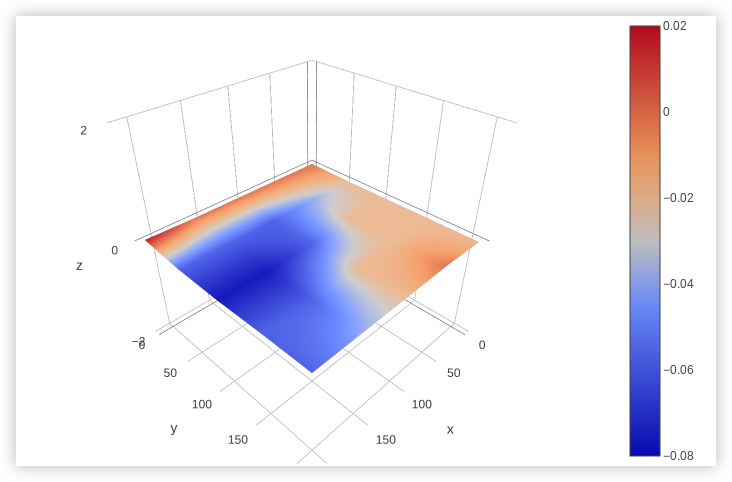

# AnyCubic i3 Mega-S

Notes, Firmware, Configs, Scripts, etc. for my AnyCubic i3 Mega-S Printer

## Upgrades

- [x] [Marlin-Ai3M](./Firmware/Marlin-Ai3M) Firmware
- [ ] TMC2208 Stepper Motor Drivers
- [ ] New Motherboard Fan
- [ ] New Hotend Radiator Fan
- [x] Mesh Bed Leveling
- [ ] Auto Bed Leveling (UBL)

## Calibration

| Setting         | Value                           | Notes                                      |
| :-------------- | ------------------------------- | ------------------------------------------ |
| E-Steps         | 421.98                          |                                            |
| LinAdv K-Factor | 0.40                            | Strangely Low for Bowden, but works great. |
| Hotend PID      | P15.94 I1.17 D54.19             |                                            |
| Bed PID         | P251.78 I49.57 D319.73          |                                            |

## Bed Mesh

Plot of current bed mesh settings. [Here are the points.](./BEDMESH.md)

> Plot Generated by [OctoPrint-BedLevelVisualizer](https://github.com/jneilliii/OctoPrint-BedLevelVisualizer) via [Plotly](https://plot.ly/)