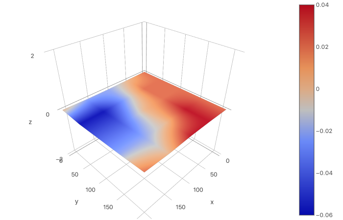

# AnyCubic i3 Mega-S

Notes, Firmware, Configs, Scripts, etc. for my AnyCubic i3 Mega-S Printer

## Upgrades

- [x] [Marlin-Ai3M](https://github.com/BradenM/Marlin-Ai3M) Firmware
- [x] TMC2208 Stepper Motor Drivers
- [ ] New Motherboard Fan
- [ ] New Hotend Radiator Fan
- [x] Mesh Bed Leveling
- [ ] Auto Bed Leveling (UBL)
- [x] Octoprint

## Calibration

Settings that I have tuned for my specific printer. [See Here](./Firmware/README.md) for firmware changes.

| Setting             | Value                  | Notes                                   |
| :------------------ | ---------------------- | --------------------------------------- |
| E-Steps             | 410.57                 |                                         |
| LinAdv K-Factor     | 0.50                   | Low for Bowden, but works great.        |
| Junction Deviation  | 0.050                  | Provides much cleaner corners than Jerk |
| Print Acceleration  | 1500.00                |                                         |
| Travel Acceleration | 3000.00                |                                         |
| Hotend PID          | P15.94 I1.17 D54.19    |                                         |
| Bed PID             | P251.78 I49.57 D319.73 |                                         |

## Bed Mesh

Plot of current bed mesh settings. [Here are the points.](./BEDMESH.md)

> Plot Generated by [OctoPrint-BedLevelVisualizer](https://github.com/jneilliii/OctoPrint-BedLevelVisualizer) via [Plotly](https://plot.ly/)
